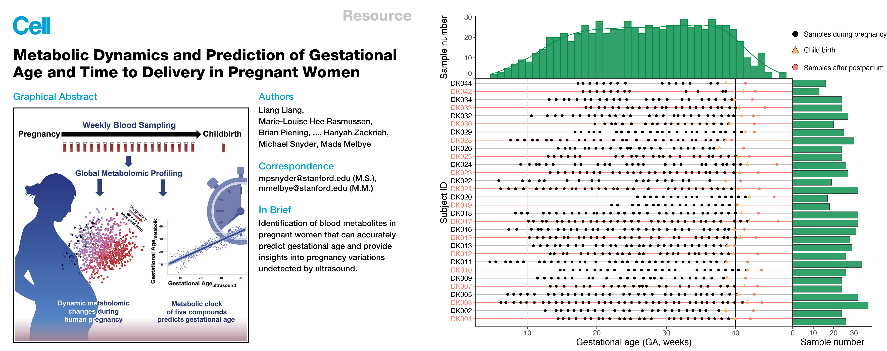

## **Introduction**

The case study dataset from the our previous published study to predict the gestational age (GA, week) of pregnant women ([Liang et al, Cell, 2020](https://pubmed.ncbi.nlm.nih.gov/32589958/)). This study aims to predict the GA of pregnant women, so we could provide a non-invasive method for pregnancy dating. 

[Paper link is here](https://pubmed.ncbi.nlm.nih.gov/32589958/)

## **Down the demo data**

### **mzXML data**

The LC-MS data (mzXML format) were deposited to the NIH Common Fund’s National Metabolomics Data Repository (NMDR) website, the Metabolomics Workbench, the project ID is [PR000918](https://doi.org/10.21228/M81H58) (https://doi.org/10.21228/M81H58).

### **Metabolic feature table**

1. [Normal dataset]()

2. [RT shift dataset]()

### **Pseudo-MS image datasets**

1. [Normal dataset]()

2. [RT shift dataset]()

## **DeepPseduoMSI prediction result**

