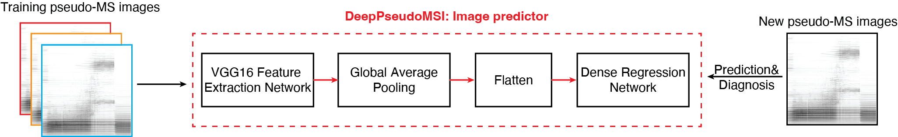

---
# An instance of the Blank widget.
# Documentation: https://wowchemy.com/docs/getting-started/page-builder/
widget: blank

# Activate this widget? true/false
active: true

# This file represents a page section.
headless: true

# Order that this section appears on the page.
weight: 15

title: DeepPseudoMSI
subtitle: Deep learning-based pseudo-mass spectrometry imaging analysis for precision medicine

design:
  columns: "1"
  background:
    image: open-book.jpg
    image_darken: 1.0
    image_parallax: true
    image_position: center
    image_size: cover
    text_color_light: false
  spacing:
    padding: ["20px", "0", "20px", "0"]
---

The `deepPseudoMSI` project is the first method that convert LC-MS raw data to "images" and then process them using deep learning method for diagnosis. It contains two parts.

**1. Pseudo-MS image converter**

---

One LC-MS raw data usually contains millions of data points, so we need to divide it into different pixels (or grids) based on the revolution in the x-axis (RT) and y-axis (m/z) to reduce the size. All the data points in the same pixel are combined to represent the intensity of this pixel.  The intensity of each pixel is linearly transformed to the color of the pixel (grey degree). Finally, one LC-MS raw data with millions of data points is converted into an image with thousands of pixels based on the resolution (for example, 224 × 224), we call it the pseudo-MS image, which contains all the information from the LC-MS raw data.

[Code is here](https://github.com/jaspershen/deepPseudoMSI/tree/main/code/pseudoMS-image-converter)

**2. Image predictor**

---

